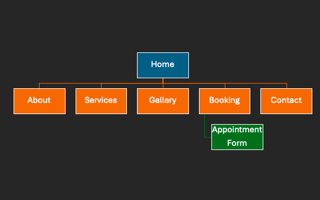

# Luxe Glow Hair Studio
My WEDE POE

## Student Information
**Student number:** ST10514400  
**Student Name:** Thabiso

## Project Overview

•	Organisation name
-	Luxe Glow Hair Studio

•	Brief History
-	Luxe Glow Hair Studio is a home based hair salon established in 2023 in Pretoria, South Africa. The business was founded by a professionally trained hairstylist with the aim of providing affordable, high-quality haircare services in a comfortable and personalised environment. Initially serving friends and family, the salon has grown steadily through word of mouth marketing and social media engagement.

•	Mission and Vision Statement
-	The mission of Luxe Glow Hair Studio is to provide professional , affordable, and convenient haircare services that enhance clients confidence and personal style.
-	The vision of the salon is to become a leading home-based haircare brand in Pretoria, recognised for exceptional service quality, creativity and customer satisfaction.

  •	Target Audience
-	The primary target audience includes young adults aged 18-35, working professionals, students, and women seeking affordable and convenient haircare services within Pretoria and surrounding areas. Understanding the target audience is essential.

## Website Goals and Objectives
•	The main goal of the website is to establish a strong online presence and improve customer accessibility. Additional goals include increasing website traffic, generating leads, promoting services and enhancing brand credibility.

•	Objectives:
-	To enable online appointment bookings.
-	To provide clear and detailed service information,
-	To showcase a portfolio of hairstyles.
-	To improve communication between the business and its clients.

•	Key Performance Indicators(KPIs)

             The success of the website will be measured using the following  KPI’s:

-	Website traffic.
-	Conversion rate(visitors to bookings).
-	Bounce rate.
-	Number of online bookings.
-	Social media engagement.

## Timeline and Milestones

•	A project timeline ensures the successful development and delivery of the website.

Phase	Activity	Duration 
•	Week 1	Research and planning.	-1 Week 
•	Week 2	Wireframing and design.	-1 Week 
•	Week 3-4	Website development.	-2 Weeks 
•	Week 5	Testing and revisions.	-1 Week 
•	Week 6	Final deployment	      -1 Week 

Key Milestones

•	Completion of proposal.

•	Approval of wireframes.

•	Development of website.

•	Testing and quality assurance.

•	Final submission and launch.

## Sitemap

  

## References

•	Chaffey, D., 2022. Digital marketing: Strategy, implementation and practice. 8th ed. Harlow: Pearson. 

•	Laudon, K.C. and Traver, C.G., 2021. E-commerce 2021: Business, technology, society. 16th ed. Harlow: Pearson. 

•	Tuten, T.L. and Solomon, M.R., 2020. Social media marketing. 3rd ed. London: Sage. 

•	Kingsnorth, S., 2022. Digital marketing strategy: An integrated approach to online marketing. 3rd ed. London: Kogan Page. 

•	Hall, J., 2021. Online marketing for small businesses. London: Routledge. 

